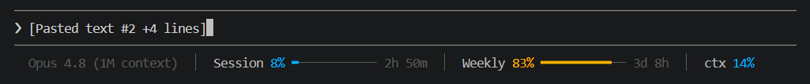

# Claude Token Counter

**See your Claude usage right under the prompt — the same Session, Weekly and
context numbers the desktop app shows, but in the [Claude Code](https://claude.com/claude-code)
terminal, in every session, automatically.**



```
Opus 4.8 (1M context)  │  Session 8% ▪──── 2h 50m  │  Weekly 83% ━━━━ 3d 8h  │  ctx 14%
```

- **Session** — how much of your rolling **5-hour** limit you've used, and when it resets
- **Weekly** — how much of your **7-day** limit you've used, and when it resets
- **ctx** — how full the current conversation's context window is

Bars are thin and low-profile, coloured **blue** while healthy and escalating to
**amber ≥ 75%** and **red ≥ 90%** so you notice before you hit a wall.

---

## Requirements

- **[Claude Code](https://claude.com/claude-code)** (the CLI) — v2.1 or newer
- **[Node.js](https://nodejs.org/)** 18+ — the only dependency, and Claude Code already needs it
- A **Claude Pro or Max** plan — the Session/Weekly numbers come from your
  subscription limits, which Claude Code only reports on paid plans. Without it
  you still get the `ctx` meter. (See [Notes](#notes).)

Works on **Windows, macOS, and Linux**.

---

## Install

Clone it anywhere and run the installer once:

```bash
git clone https://github.com/aniketshaw748-hub/ClaudeTokenCounter.git
cd ClaudeTokenCounter
node install.mjs
```

Then **restart Claude Code** (or start a new session). That's it.

<details>
<summary><b>Prefer one click?</b></summary>

- **Windows** — double-click **`install.cmd`**
- **macOS / Linux** — run **`./install.sh`**

Both just call `node install.mjs` for you.
</details>

<details>
<summary><b>No git?</b> Download the ZIP instead</summary>

Click **Code ▸ Download ZIP** on the GitHub page, unzip it anywhere, open a
terminal in that folder, and run `node install.mjs` (or double-click
`install.cmd` on Windows).
</details>

The installer:

1. adds a `statusLine` entry to `~/.claude/settings.json` pointing at your copy
   of `statusline.mjs` — **your existing settings are kept**, and a
   `settings.json.bak` backup is written first;
2. installs the **`/tokenbar`** slash command.

It figures out the correct path automatically, so it works no matter where you
put the folder.

---

## Switch layouts: compact ⇄ full

Two layouts ship in the box:

```
full     Opus 4.8  │  Session 5% ━─────────── 3h 35m  │  Weekly 83% ━━━━━━━━━━── 3d 9h  │  ctx 8%
compact  S 5% ───── 3h35m   W 83% ━━━━─ 3d9h   ctx 8%
```

Flip between them any time — the change shows on the next status-line refresh:

| How | Command |
| --- | --- |
| **Slash command** (easiest) | type `/tokenbar` in Claude Code |
| Terminal | `node statusline.mjs toggle` |
| Pin one | `node statusline.mjs compact` &nbsp;/&nbsp; `node statusline.mjs full` |
| Back to auto | `node statusline.mjs auto` |
| Env override | set `TOKENBAR_MODE=compact` (or `full`) |

The layout is resolved in this order: `TOKENBAR_MODE` env var → the pin file
(`~/.claude/tokenbar-mode`) → terminal width (if Claude Code exposes it) →
default **full**.

---

## Customize

Everything lives in one dependency-free file, `statusline.mjs`:

- **Colours & thresholds** — the `CLR` palette and `pctColor()` (the 75% / 90% cutoffs)
- **Bar width / style** — the `LAYOUTS` object (cell widths) and `bar()` (the `━`/`─` glyphs)
- **What's shown & order** — the `render()` function; drop `ctx`, add cost, reorder freely
- **No colour** — respects the `NO_COLOR` environment variable

Preview your changes without launching Claude Code — the harness renders every
layout against sample data:

```bash
node test.mjs
```

---

## Uninstall

```bash
node install.mjs --uninstall
```

Removes the `statusLine` entry (keeping the rest of your settings) and the
`/tokenbar` command, then restart Claude Code.

---

## Notes

- **Where the numbers come from.** Claude Code passes live session data to the
  status line on every render, including `rate_limits.five_hour` and
  `rate_limits.seven_day`
  ([schema](https://code.claude.com/docs/en/statusline.md)). This tool just
  formats them — nothing is sent anywhere, and there are no API keys.
- **"usage warms up after the first reply…"** — the Session/Weekly data only
  arrives after Claude Code's first API response in a session, and only on
  Pro/Max plans. Until then you'll see that hint plus the `ctx` meter; the bars
  fill in on the first reply.
- **Local numbers.** Like Claude Code's built-in `/usage`, these percentages
  reflect activity on **this machine** — they won't include usage from claude.ai
  or your other devices.

---

## Troubleshooting

| Symptom | Fix |
| --- | --- |
| Nothing appears | Restart Claude Code / start a new session after installing. |
| Only `ctx` shows, no Session/Weekly | You're not on Pro/Max, or it's before the first reply of the session. |
| `token-counter: … not found` | Node isn't on your PATH — install it from [nodejs.org](https://nodejs.org/). |
| `/tokenbar` not recognized | Slash commands load at startup — restart Claude Code once. |
| Want your old settings back | Restore `~/.claude/settings.json.bak`. |

---

## License

[MIT](LICENSE) © 2026
